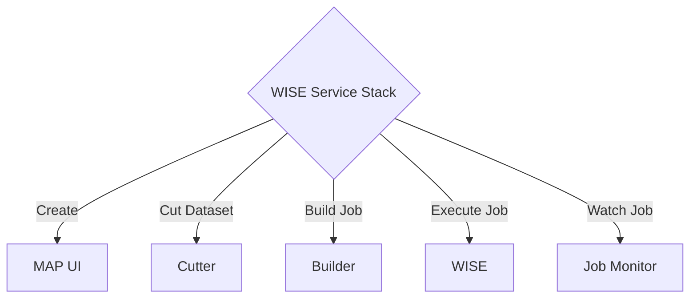

# WISE Service


This builds a stack of containers that provide basic fire modelling services.
This was built and tested on docker, it works for me, Your milage may vary.



## Setup

### Clone the project to your docker host

```sh
git clone https://github.com/WISE-Developers/wise_service.git
```

### CD to the repo folder

```SH
cd wise_service
```

### Copy the sample.env to .env

```sh
cp sample.env .env
```

### Edit the .env file to suit

```SH
nano .env
```

### Deploy the stack

```SH
docker compose up -d
```
