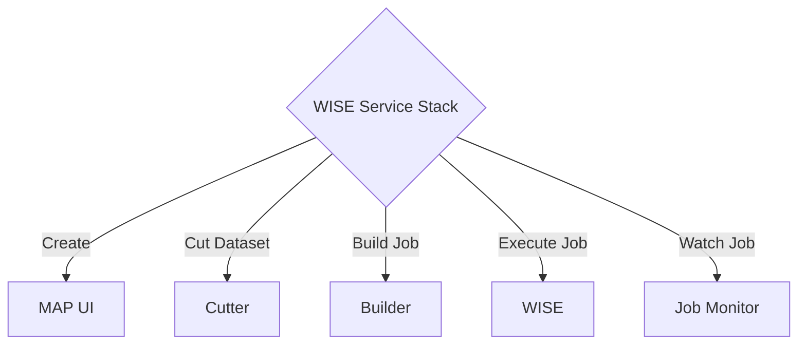

# WISE Service

This builds a stack of containers that provide basic fire modelling services.

```mermaid
flowchart TD
  C{WISE Service Stack}
  C -->|Create| A[MAP UI]
  C -->|Cut Dataset| G[Cutter]
  C -->|Build Job| E[Builder]
  C -->|Execute Job| D[WISE]
  C -->|Watch Job| F[Job Monitor]
```
